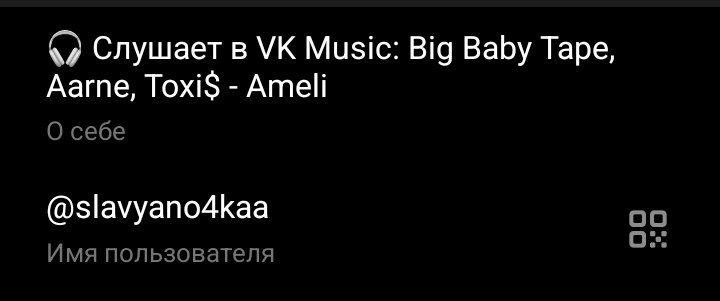
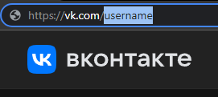

### Трансляция музыки из VK Music в описании профиля Telegram
В отличие от других способов отображения статуса, где нужен сервисный ключ доступа VK Apps, здесь достаточно просто указать ссылку на вашу страницу.



## Инструкция

### Установка

### Шаг 1:
Клонируем репозиторий с GitHub.
```bash
git clone https://github.com/slavyano4kaa/telegram-vkmusic-status-noapp.git
```

### Шаг 2:
Переходим в папку репозитория.
```bash
cd telegram-vkmusic-status-noapp
```

### Шаг 3:
Устанавливаем все зависимости из файла `requirements.txt` с помощью пакетного менеджера pip.

```bash
pip install -r requirements.txt
```

### Подготовка

### Шаг 1:
На главной странице VK включите Трансляцию аудиозаписи на страницу  


### Шаг 2:
Перейдите на страницу [My Telegram](https://my.telegram.org/) и войдите в ваш аккаунт Telegram

### Шаг 3:
Перейдите на API development tools
   **(Если у вас ещё не создано приложение, вам будет предложено его создать.)**
   
### Шаг 4:
В App Configuration скопируйте `App api_id` и `App api_hash`

  

### Шаг 5:
Скопируйте ссылку на вашу страницу в ВК после vk.com (или же ваш ID) и сохраните её

  

### Шаг 6:
Укажите свои данные в переменных `api_id`, `api_hash`, `vk_url` и `defaultabout` в файле **main.py**

```python
api_id = 000000000
api_hash = 'yourapihash'
vk_url = 'yourvklink'
defaultabout = 'youraboutme'
```

`api_id` и `api_hash` – App Configuration вашего приложения Telegram (шаг 4)

`vk_url` – ссылка на вашу страницу ВКонтакте (шаг 5)

`defaultabout` – описание, которое будет отображаться в профиле Telegram если музыка не играет

### Запуск приложения

1. Запустите исполняемый файл
```bash
python main.py
```
2. Выполните вход в Telegram
